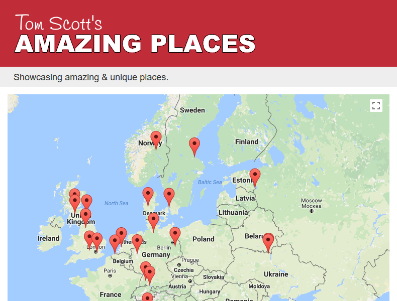

# Tom Scott's Amazing Places Map

Unofficial website for Tom Scott's [amazing places](https://www.youtube.com/playlist?list=PL96C35uN7xGK_y459BdHCtGeftqs5_nff) video series.

## Dependencies
- [Google Maps JavaScript API (version 3)](https://developers.google.com/maps/documentation/javascript/)
- [JQuery 3.4.1](https://jquery.com/)
- [JQuery.dotdotdot 3.2.3](https://github.com/FrDH/jQuery.dotdotdot)

## License

Code in this repository is licensed under the GNU General Public License Version 3. Details can be found in the [LICENSE](LICENSE) file. 

## Disclaimer

This is unofficial and is not run by [Tom Scott](https://www.tomscott.com/).
